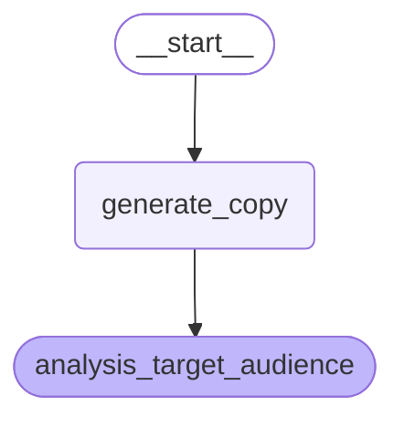

## はじめに

株式会社 NTT データ デジタルサクセスコンサルティング事業部の [@ren8k](https://qiita.com/ren8k) です．

## 目的

本検証の目的は，LangGraph (Python) で実装した Agent のストリーミング処理 を AWS 上でサーバーレスで実現することです．ストリーミング処理として，LangGraph の [`stream` メソッド](https://langchain-ai.github.io/langgraph/concepts/streaming/)を利用します．LangGraph のストリーミング処理は，グラフの実行完了を待たずに，逐次的にノードの実行結果を返します．

AWS Lambda は，サーバーレスコンピューティングサービスとして代表的なサービスですが，執筆時点（2025/01/01）において，Lambda は Node.js のマネージドランタイムでのみレスポンスストリーミングをサポートしています．その他の言語でレスポンスストリーミングを実現する場合は，「カスタムランタイムの作成」か Lambda Web Adapter (LWA)の利用」が必要です．

https://docs.aws.amazon.com/ja_jp/lambda/latest/dg/configuration-response-streaming.html

そこで，本検証では，容易に実装可能な Lambda Web Adapter を利用することで，Lambda から LangGraph (Python) のストリーミングレスポンスを取得可能かを確認します．

<details><summary> 補足説明 </summary>

:::note info

通常，Lambda における Python マネージドランタイムでは，以下の形式で一度にすべてのレスポンスを返す必要があります．

```py
def lambda_handler(event, context):
    # 処理
    return {
        'statusCode': 200,
        'body': 'レスポンス'
    }
```

一方，Python マネージドランタイムは，ストリーミングレスポンスを直接サポートしていません．具体的には，以下のようには実装できません．

```py
def lambda_handler(event, context):
    for chunk in generate_response():  # 本来はこのように少しずつデータを返したい
        yield chunk  # ← これができない
```

Lambda Web Adapter (LWA) と Web フレームワークを介すことで，ストリーミングを実現できます．

```py
from fastapi.responses import StreamingResponse

# Lambda Web Adapter + FastAPIを使用した場合
@app.post("/stream")
def stream_response():
    return StreamingResponse(
        generate_response(),  # yieldを使ったジェネレータ関数
        media_type="text/event-stream"
    )
```

:::

</details>

## 検証で利用する Agent

簡単のため，以下のような [workflow 型](https://www.anthropic.com/research/building-effective-agents)の Agent を利用します．



本 Agent は，与えられた商品情報から「広告コピー文」と「ターゲットとする顧客」を提案する Agent です．Prompt chaining により 以下のステップでノードを連続して実行します．

- step0. 商品情報を入力 (`__start__` ノード)
- step1. step0. の結果を基に，広告文を生成 (`generate_copy` ノード)
- step2. step1. の結果を基に，ターゲットとする顧客を分析 (`analysis_target_audience` ノード)

本検証では，LangGraph の [`stream` メソッド](https://langchain-ai.github.io/langgraph/concepts/streaming/)を利用して，`generate_copy` ノード，`analysis_target_audience` ノードの結果をストリーミングで取得します．

## Lambda Web Adapter (LWA) とは

LWA は，Flask，Express.js などの一般的なウェブフレームワークで作られたアプリケーションを Lambda 上で実行できるようにするためのツールです．具体的には，LWA は Lambda で受信したイベントを Web アプリケーションに HTTP で転送するプロキシとして機能します．LWA は単なるアダプター（変換層）であり，実際の HTTP リクエスト/レスポンスの処理機能は持っていません．つまり，Web フレームワークを利用し，HTTP リクエストを処理する Web アプリケーションを用意する必要があります．


> [Lambda Web Adapter でウェブアプリを (ほぼ) そのままサーバーレス化する](https://aws.amazon.com/jp/builders-flash/202301/lambda-web-adapter/?awsf.filter-name=*all) から引用

LWA の呼び出し元としては以下が利用可能です．本検証では，ストリーミングレスポンスを取得するため，Lambda Function URL を利用します．

- API Gateway
- Lambda Function URL
- ALB

## 利用手順

以下の手順で，LWA を利用して，LangGraph のストリーミング処理を実現します．

- Web アプリケーションの準備
- Docker ファイルの作成
- ECR に Docker イメージを push
- Lambda の作成
- Lambda Function URL 経由でのストリーミングレスポンス取得

### Web アプリケーションの準備

FastAPI と Uvicorn を利用し，Web アプリケーションを実装します．以下に，FastAPI の簡易実装を示します．関数 `api_stream_graph` にて，`StreamingResponse` を利用してストリーミングレスポンスを返しています．また，Lambda Web Adapter のデフォルトポートは `8080` なので，Uvicorn のポートを `8080` に変更しています．

<details open><summary>実装</summary>

```python:main.py
import os

import uvicorn
from agent import stream_graph
from fastapi import FastAPI
from fastapi.middleware.cors import CORSMiddleware
from fastapi.responses import StreamingResponse
from pydantic import BaseModel

app = FastAPI()

# CORSミドルウェアの設定 (本番環境では適切なオリジンを指定してください)
app.add_middleware(
    CORSMiddleware,
    allow_origins=["http://localhost:3000"],
    allow_credentials=True,
    allow_methods=["*"],
    allow_headers=["*"],
)


class Input(BaseModel):
    product_detail: str


@app.post("/api/stream_graph")
def api_stream_graph(input: Input):
    return StreamingResponse(
        stream_graph(input.product_detail), media_type="application/json; charset=utf-8"
    )


if __name__ == "__main__":
    uvicorn.run(app, host="0.0.0.0", port=int(os.environ.get("PORT", "8080"))) # Default port of LWA is 8080
```

</details>

以下に，Agent の実装を示します．関数 `stream_graph` にて，LangGraph のストリーミング処理を実行しています．LLM としては，Bedrock Claude3.5 Haiku を利用しています．また，最近新しく追加された機能である [`Command`](https://blog.langchain.dev/command-a-new-tool-for-multi-agent-architectures-in-langgraph/) を利用しています．

<details open><summary>実装</summary>

```python:agent.py
import json
from typing import Annotated, Any, Generator

from langchain_aws import ChatBedrock
from langchain_core.prompts import ChatPromptTemplate
from langgraph.graph import START, StateGraph
from langgraph.graph.state import CompiledStateGraph
from langgraph.types import Command
from typing_extensions import TypedDict

llm = ChatBedrock(
    model="us.anthropic.claude-3-5-haiku-20241022-v1:0",
    region="us-west-2",
)


# Define graph state
class State(TypedDict):
    product_detail: Annotated[str, "製品詳細"]
    copy: Annotated[str, "コピー"]
    target_audience: Annotated[str, "ターゲット顧客"]


# Define the nodes
def generate_copy(state: State) -> Command:
    print("Called generate_copy")
    human_prompt = """
    以下の製品情報から，商品の広告文を作成しなさい．最終的な広告文を1つのみ出力すること．
    <product_details>
    {product_detail}
    </product_details>
    """
    prompt = ChatPromptTemplate([("human", human_prompt)])
    chain = prompt | llm
    response = chain.invoke({"product_detail": state["product_detail"]})

    return Command(
        update={"copy": response.content},
        goto="analysis_target_audience",
    )


def analysis_target_audience(state: State) -> Command:
    print("Called analysis_target_audience")
    human_prompt = """
    以下の広告文に基づいて，最適なターゲット層を分析してください．最終的なターゲット層のみ出力すること．
    <copy>
    {copy}
    </copy>
    """
    prompt = ChatPromptTemplate([("human", human_prompt)])
    chain = prompt | llm
    response = chain.invoke({"copy": state["copy"]})

    return Command(
        update={"target_audience": response.content},
    )


def build_graph() -> CompiledStateGraph:
    builder = StateGraph(State)
    builder.add_edge(START, "generate_copy")
    builder.add_node("generate_copy", generate_copy)
    builder.add_node("analysis_target_audience", analysis_target_audience)
    return builder.compile()


def stream_graph(input: str) -> Generator[str, Any, None]:
    print("Starting graph")
    graph = build_graph()
    stream = graph.stream(input={"product_detail": input}, stream_mode="values")
    for state in stream:
        yield json.dumps(state, ensure_ascii=False) + "\n"
```

</details>

### Docker ファイルの作成

以下に，Dockerfile の実装を示します．既存のアプリケーション用の Dockerfile に 2 行目の COPY コマンドを追記するだけで，LWA のインストールが可能です．また，LWA でストリーミングレスポンスを処理する場合，環境変数 `AWS_LWA_INVOKE_MODE` を `RESPONSE_STREAM` に設定する必要があります．(本環境変数の設定は，Lambda 側で実施しても問題ないです．)

```bash
FROM public.ecr.aws/docker/library/python:3.12.0-slim-bullseye
COPY --from=public.ecr.aws/awsguru/aws-lambda-adapter:0.8.4 /lambda-adapter /opt/extensions/lambda-adapter

WORKDIR /app
ADD . .
RUN pip3 install --no-cache-dir -r requirements.txt

ENV AWS_LWA_INVOKE_MODE RESPONSE_STREAM
CMD ["python", "main.py"]
```

:::note info
上記のコンテナイメージは，Lamabda 以外の環境でも利用可能なので，ローカルでの動作確認が容易です．
:::

### ECR に Docker イメージを push

上記の Dockerfile をビルドし，ECR にプッシュします．以下の手順を使用して，リポジトリに対してイメージを認証し，プッシュします．

```bash
# Retrieve an authentication token and authenticate your Docker client to your registry.
aws ecr get-login-password --region ap-northeast-1 | docker login --username AWS --password-stdin 12345678910.dkr.ecr.ap-northeast-1.amazonaws.com

# Build the Docker image
docker build -t <name> .

# Tag the image so you can push the image to this repository
docker tag <name>:latest 12345678910.dkr.ecr.ap-northeast-1.amazonaws.com/<name>:latest

# Push the image to the repository
docker push 12345678910.dkr.ecr.ap-northeast-1.amazonaws.com/<name>:latest
```

### Lambda の作成

詳細は述べませんが，以下の点に留意して Lambda を作成します．

- コンテナイメージから関数を作成
  - ECR にプッシュした Docker イメージを利用します．
- Bedrock のポリシー付与
  - `'bedrock:InvokeModel'` に対するポリシーを付与します．
- 関数 URL の作成
  - 今回は検証のため，認証タイプ: NONE とします．
  - 関数 URL の設定で，呼び出しモード: RESPONSE_STREAM にします．
- Lambda の最大実行時間の変更
  - 5 分に延長します．

### Lambda Function URL 経由でのストリーミングレスポンス取得

curl などで，Lambda Function URL に対して POST リクエストを送信することで，ストリーミングレスポンスを取取得できます．

```bash
#!/bin/bash
LAMBDA_URL="https://XXXXXXXXXXXXXXXXXXXXXXXXXXXXX.lambda-url.ap-northeast-1.on.aws/"
ENDPOINT="api/stream_graph"
API_URL="${LAMBDA_URL}${ENDPOINT}"
PRODUCT_DETAIL="ラベンダーとベルガモットのやさしい香りが特徴の保湿クリームで、ヒアルロン酸とシアバターの配合により、乾燥肌に潤いを与えます。"

curl -X 'POST' \
  "${API_URL}" \
  -H 'accept: application/json' \
  -H 'Content-Type: application/json' \
  -d "{
  \"product_detail\": \"${PRODUCT_DETAIL}\"
}"
```

上記では，商品情報として，`ラベンダーとベルガモットのやさしい香りが特徴の保湿クリームで、ヒアルロン酸とシアバターの配合により、乾燥肌に潤いを与えます。` という文を与えています．この場合，以下のようなレスポンスをストリーミングで取得できます．

```
{"product_detail": "ラベンダーとベルガモットのやさしい香りが特徴の保湿クリームで、ヒアルロン酸とシアバターの配合により、乾燥肌に潤いを与えます。"}
{"product_detail": "ラベンダーとベルガモットのやさしい香りが特徴の保湿クリームで、ヒアルロン酸とシアバターの配合により、乾燥肌に潤いを与えます。", "copy": "乾燥肌にやさしい愛のケア✨ラベンダーとベルガモットの香りに包まれながら、ヒアルロン酸とシアバターが肌に深い潤いを与える、至福の保湿クリーム、あなたの肌を優しく癒します🌿✨"}
{"product_detail": "ラベンダーとベルガモットのやさしい香りが特徴の保湿クリームで、ヒアルロン酸とシアバターの配合により、乾燥肌に潤いを与えます。", "copy": "乾燥肌にやさしい愛のケア✨ラベンダーとベルガモットの香りに包まれながら、ヒアルロン酸とシアバターが肌に深い潤いを与える、至福の保湿クリーム、あなたの肌を優しく癒します🌿✨", "target_audience": "20代後半から40代前半の女性で、乾燥肌に悩み、自然由来の成分にこだわり、心地よい香りと高い保湿力を求めるライフスタイル重視の美意識の高い層。"}
```

各行が，`__start__` ノード，`generate_copy` ノード，`analysis_target_audience` ノード終了時点の State を表しています．`copy` キーには，生成された広告文が，`target_audience` キーには，ターゲットとする顧客が格納されています．

## CDK 実装

上記の ECR へのイメージのプッシュや Lambda の作成を，CDK で実装しました．

## フロントエンドの実装

### Streamlit

### React

```javascript
import { useState } from "react";
import "./App.css";

// API設定
const API_CONFIG = {
  LAMBDA_URL:
    "https://XXXXXXXXXXXXXXXXXXXXXXXXXXXXX.lambda-url.ap-northeast-1.on.aws/",
  ENDPOINT: "api/stream_graph",
  get API_URL() {
    return `${this.LAMBDA_URL}${this.ENDPOINT}`;
  },
  HEADERS: {
    "Content-Type": "application/json",
    Accept: "text/event-stream",
  },
};

// カスタムフック: APIとの通信を管理
const useProductAnalysis = () => {
  const [copy, setCopy] = useState("");
  const [targetAudience, setTargetAudience] = useState("");
  const [isLoading, setIsLoading] = useState(false);
  const [error, setError] = useState(null);

  const analyzeProduct = async (productDetail) => {
    setIsLoading(true);
    setCopy("");
    setTargetAudience("");
    setError(null);

    try {
      const response = await fetch(API_CONFIG.API_URL, {
        method: "POST",
        headers: API_CONFIG.HEADERS,
        credentials: "omit",
        mode: "cors",
        body: JSON.stringify({ product_detail: productDetail }),
      });

      if (!response.ok) {
        throw new Error(`HTTP error! status: ${response.status}`);
      }

      await processStream(response.body.getReader());
    } catch (error) {
      console.error("Error:", error);
      setError(error.message || "予期せぬエラーが発生しました");
    } finally {
      setIsLoading(false);
    }
  };

  // ストリーム処理
  const processStream = async (reader) => {
    const decoder = new TextDecoder();
    let buffer = "";

    try {
      while (true) {
        const { done, value } = await reader.read();

        if (done) {
          processBuffer(buffer);
          break;
        }

        buffer += decoder.decode(value, { stream: true });
        const lines = buffer.split("\n");
        buffer = lines.pop() || "";

        lines.forEach((line) => processBuffer(line));
      }
    } catch (error) {
      console.error("Stream processing error:", error);
      throw error;
    }
  };

  // 個々のJSONデータを処理
  const processBuffer = (buffer) => {
    if (!buffer.trim()) return;

    try {
      const data = JSON.parse(buffer);
      if (data.copy) setCopy(data.copy);
      if (data.target_audience) setTargetAudience(data.target_audience);
    } catch (error) {
      console.error("JSON parsing error:", error);
    }
  };

  return {
    copy,
    targetAudience,
    isLoading,
    error,
    analyzeProduct,
  };
};

// 結果表示用コンポーネント
const ResultCard = ({ title, content, emoji, isTargetAudience }) => (
  <div className="result-card">
    <h2 className="result-title">
      {emoji} {title}
    </h2>
    <div
      className={
        isTargetAudience ? "target-audience-content" : "result-content"
      }
    >
      <p>{content}</p>
    </div>
  </div>
);

// メインコンポーネント
const App = () => {
  const [productDetail, setProductDetail] = useState("");
  const { copy, targetAudience, isLoading, error, analyzeProduct } =
    useProductAnalysis();

  const handleSubmit = (e) => {
    e.preventDefault();
    analyzeProduct(productDetail);
  };

  return (
    <div className="container">
      <div className="card">
        <h1 className="title">商品広告生成アプリ</h1>
        <h2 className="subtitle">商品詳細</h2>

        <form onSubmit={handleSubmit} className="form">
          <textarea
            value={productDetail}
            onChange={(e) => setProductDetail(e.target.value)}
            className="textarea"
            rows={4}
            placeholder="例: ラベンダーとベルガモットのやさしい香りが特徴の保湿クリームで、ヒアルロン酸とシアバターの配合により、乾燥肌に潤いを与えます。価格は50g入りで3,800円（税込）です。"
            required
          />
          <button type="submit" disabled={isLoading} className="button">
            {isLoading ? "実行中..." : "Agent 実行開始"}
          </button>
        </form>

        {error && <div className="error">{error}</div>}

        {copy && (
          <ResultCard title="生成された広告文" content={copy} emoji="📝" />
        )}

        {targetAudience && (
          <ResultCard
            title="ターゲット層分析"
            content={targetAudience}
            emoji="🎯"
            isTargetAudience={true}
          />
        )}
      </div>
    </div>
  );
};

export default App;
```

## まとめ

summary

## 仲間募集

NTT データ テクノロジーコンサルティング事業本部 では、以下の職種を募集しています。

<details><summary>1. クラウド技術を活用したデータ分析プラットフォームの開発・構築(ITアーキテクト/クラウドエンジニア)</summary>

クラウド／プラットフォーム技術の知見に基づき、DWH、BI、ETL 領域におけるソリューション開発を推進します。
https://enterprise-aiiot.nttdata.com/recruitment/career_sp/cloud_engineer

</details>

<details><summary>2. データサイエンス領域（データサイエンティスト／データアナリスト）</summary>

データ活用／情報処理／AI／BI／統計学などの情報科学を活用し、よりデータサイエンスの観点から、データ分析プロジェクトのリーダーとしてお客様の DX／デジタルサクセスを推進します。
https://enterprise-aiiot.nttdata.com/recruitment/career_sp/datascientist

</details>

<details><summary>3.お客様のAI活用の成功を推進するAIサクセスマネージャー</summary>

DataRobot をはじめとした AI ソリューションやサービスを使って、
お客様の AI プロジェクトを成功させ、ビジネス価値を創出するための活動を実施し、
お客様内での AI 活用を拡大、NTT データが提供する AI ソリューションの利用継続を推進していただく人材を募集しています。
https://nttdata.jposting.net/u/job.phtml?job_code=804

</details>

<details><summary>4.DX／デジタルサクセスを推進するデータサイエンティスト《管理職/管理職候補》</summary>
データ分析プロジェクトのリーダとして、正確な課題の把握、適切な評価指標の設定、分析計画策定や適切な分析手法や技術の評価・選定といったデータ活用の具現化、高度化を行い分析結果の見える化・お客様の納得感醸成を行うことで、ビジネス成果・価値を出すアクションへとつなげることができるデータサイエンティスト人材を募集しています。

https://nttdata.jposting.net/u/job.phtml?job_code=898

</details>

## ソリューション紹介

<details><summary> Trusted Data Foundationについて</summary><div>

～データ資産を分析活用するための環境をオールインワンで提供するソリューション～
https://www.nttdata.com/jp/ja/lineup/tdf/
最新のクラウド技術を採用して弊社が独自に設計したリファレンスアーキテクチャ（Datalake+DWH+AI/BI）を顧客要件に合わせてカスタマイズして提供します。
可視化、機械学習、DeepLearning などデータ資産を分析活用するための環境がオールインワンで用意されており、これまでとは別次元の量と質のデータを用いてアジリティ高く DX 推進を実現できます。

</div></details>

<details><summary> TDFⓇ-AM（Trusted Data Foundation - Analytics Managed Service）について</summary><div>

～データ活用基盤の段階的な拡張支援 (Quick Start) と保守運用のマネジメント（Analytics Managed）をご提供することでお客様の DX を成功に導く、データ活用プラットフォームサービス～
https://www.nttdata.com/jp/ja/lineup/tdf_am/
TDFⓇ-AM は、データ活用を Quick に始めることができ、データ活用の成熟度に応じて段階的に環境を拡張します。プラットフォームの保守運用は NTT データが一括で実施し、お客様は成果創出に専念することが可能です。また、日々最新のテクノロジーをキャッチアップし、常に活用しやすい環境を提供します。なお、ご要望に応じて上流のコンサルティングフェーズから AI/BI などのデータ活用支援に至るまで、End to End で課題解決に向けて伴走することも可能です。

</div></details>

<details><summary> NTTデータとDatabricksについて </summary>
NTTデータは、お客様企業のデジタル変革・DXの成功に向けて、「databricks」のソリューションの提供に加え、情報活用戦略の立案から、AI技術の活用も含めたアナリティクス、分析基盤構築・運用、分析業務のアウトソースまで、ワンストップの支援を提供いたします。

https://www.nttdata.com/jp/ja/lineup/databricks/

</details>

<details><summary>NTTデータとTableauについて </summary><div>

ビジュアル分析プラットフォームの Tableau と 2014 年にパートナー契約を締結し、自社の経営ダッシュボード基盤への採用や独自のコンピテンシーセンターの設置などの取り組みを進めてきました。さらに 2019 年度には Salesforce とワンストップでのサービスを提供開始するなど、積極的にビジネスを展開しています。

これまで Partner of the Year, Japan を 4 年連続で受賞しており、2021 年にはアジア太平洋地域で最もビジネスに貢献したパートナーとして表彰されました。
また、2020 年度からは、Tableau を活用したデータ活用促進のコンサルティングや導入サービスの他、AI 活用やデータマネジメント整備など、お客さまの企業全体のデータ活用民主化を成功させるためのノウハウ・方法論を体系化した「デジタルサクセス」プログラムを提供開始しています。

https://www.nttdata.com/jp/ja/lineup/tableau/

</div></details>

<details><summary>NTTデータとAlteryxについて </summary><div>
Alteryxは、業務ユーザーからIT部門まで誰でも使えるセルフサービス分析プラットフォームです。

Alteryx 導入の豊富な実績を持つ NTT データは、最高位にあたる Alteryx Premium パートナーとしてお客さまをご支援します。

導入時のプロフェッショナル支援など独自メニューを整備し、特定の業種によらない多くのお客さまに、Alteryx を活用したサービスの強化・拡充を提供します。

https://www.nttdata.com/jp/ja/lineup/alteryx/

</div></details>

<details><summary>NTTデータとDataRobotについて </summary><div>
DataRobotは、包括的なAIライフサイクルプラットフォームです。

NTT データは DataRobot 社と戦略的資本業務提携を行い、経験豊富なデータサイエンティストが AI・データ活用を起点にお客様のビジネスにおける価値創出をご支援します。

https://www.nttdata.com/jp/ja/lineup/datarobot/

</div></details>

<details><summary> NTTデータとInformaticaについて</summary><div>

データ連携や処理方式を専門領域として 10 年以上取り組んできたプロ集団である NTT データは、データマネジメント領域でグローバルでの高い評価を得ている Informatica 社とパートナーシップを結び、サービス強化を推進しています。

https://www.nttdata.com/jp/ja/lineup/informatica/

</div></details>

<details><summary>NTTデータとSnowflakeについて </summary><div>
NTTデータでは、Snowflake Inc.とソリューションパートナー契約を締結し、クラウド・データプラットフォーム「Snowflake」の導入・構築、および活用支援を開始しています。

NTT データではこれまでも、独自ノウハウに基づき、ビッグデータ・AI など領域に係る市場競争力のあるさまざまなソリューションパートナーとともにエコシステムを形成し、お客さまのビジネス変革を導いてきました。
Snowflake は、これら先端テクノロジーとのエコシステムの形成に強みがあり、NTT データはこれらを組み合わせることでお客さまに最適なインテグレーションをご提供いたします。

https://www.nttdata.com/jp/ja/lineup/snowflake/

</div></details>
